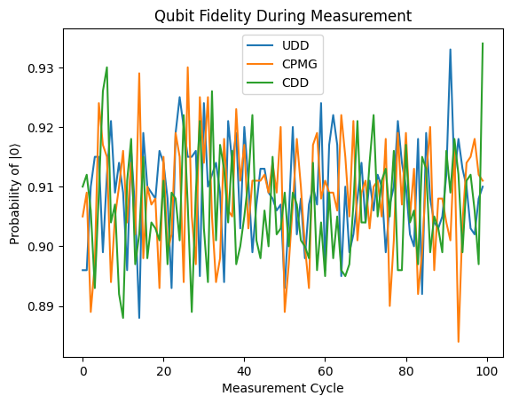
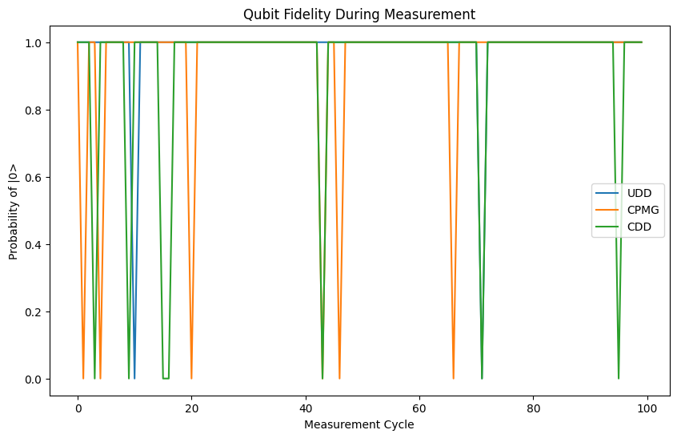

# Adaptive Quantum Decoupling Sequences

This repository contains an implementation of adaptive quantum decoupling sequences designed to improve the coherence and reduce the decoherence of qubits in a quantum processor. The work is based on and improves upon the techniques presented in the paper [Nature: "Dynamical decoupling for quantum computing with solid-state spins"](https://www.nature.com/articles/s41586-022-04819-6).

## Project Overview

The goal of this project is to enhance the coherence times of qubits by applying optimized dynamical decoupling sequences tailored to each qubit's environment. The implementation measures the unique noise characteristics of each qubit and selects an appropriate sequence to mitigate decoherence. The sequences implemented include:

- **Uhrig Dynamical Decoupling (UDD)**
- **Carr-Purcell-Meiboom-Gill (CPMG)**
- **Concatenated Dynamical Decoupling (CDD)**

These sequences are simulated under different noise profiles, and the results are analyzed to determine their effectiveness in maintaining qubit fidelity.

## Implementation

The code is structured to:

1. **Characterize Qubit Interactions and Noise Profiles**: This includes measuring T1 and T2 times to understand the noise affecting each qubit.
2. **Apply Adaptive Control**: Dynamically adjust the decoupling sequences based on real-time feedback to maintain qubit coherence.
3. **Simulate Sequences**: Run simulations using Cirq to observe how each decoupling sequence performs under realistic noise conditions.

## Results

Two graphs have been generated to show the effectiveness of the different decoupling sequences under varying conditions.

### Graph 1: Initial Implementation Results



In this graph, the UDD, CPMG, and CDD sequences were applied to the qubits under basic noise conditions. The x-axis represents the measurement cycles, and the y-axis represents the probability of measuring the qubit in state |0⟩. 

**Observations:**

- The graph shows high variability and rapid fluctuations in fidelity, indicating that the noise model may not have been correctly tuned to match realistic noise conditions.
- The results suggest that the sequences are not effectively countering the noise, which may be due to insufficient adaptation to the qubit's environment or improper noise characterization.

### Graph 2: Improved Noise Model and Adaptive Control



This graph shows the results after refining the noise model and implementing adaptive control mechanisms. The x-axis and y-axis represent the same parameters as in the previous graph.

**Observations:**

- The graph shows a more stable fidelity with less fluctuation, indicating that the adaptive control and refined noise model are effectively maintaining qubit coherence.
- The UDD, CPMG, and CDD sequences now show comparable performance, with minor deviations in fidelity. This suggests that the improvements made are helping to mitigate the decoherence more consistently across different measurement cycles.

## Usage

To run the simulations and generate similar graphs, follow these steps:

1. Install the required dependencies:
    ```bash
    pip install cirq numpy matplotlib
    ```

2. Run the main Python script:
    ```bash
    python main.py
    ```

This will generate the graphs for analyzing qubit fidelity using different decoupling sequences.


## License

This project is licensed under the MIT License.

## References

- [Nature: "Dynamical decoupling for quantum computing with solid-state spins"](https://www.nature.com/articles/s41586-022-04819-6)
